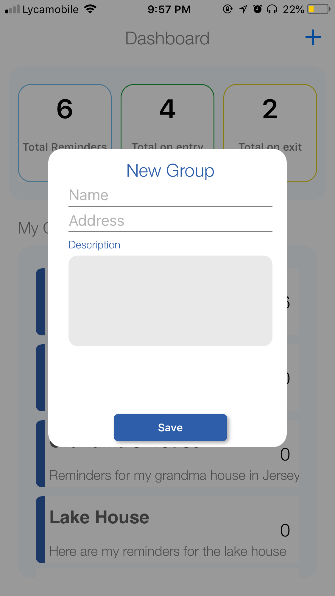
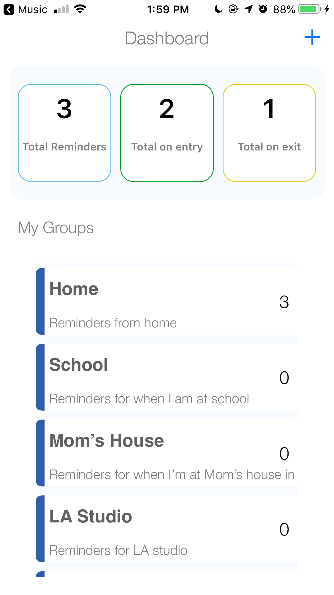
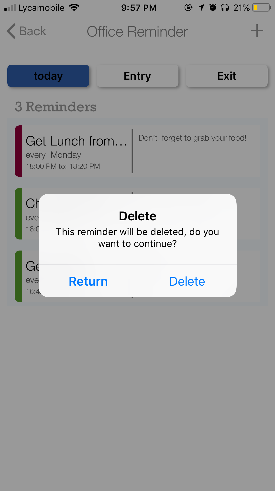
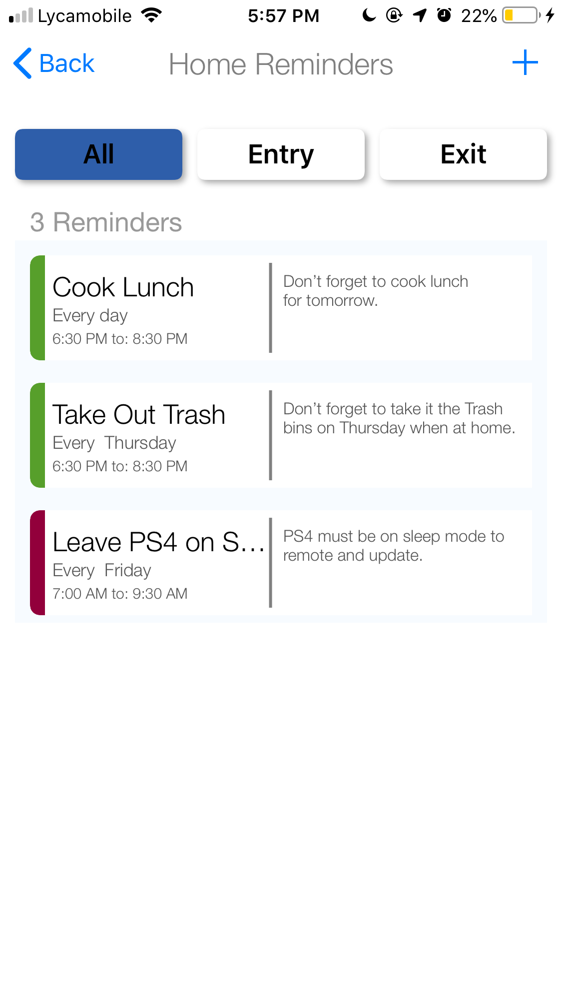
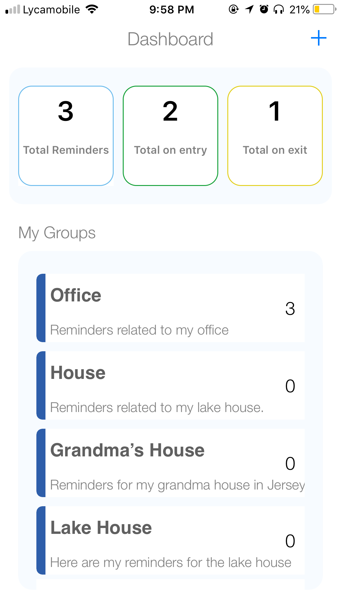

# RemindMe

### The mobile app for

A simple, Lightweight, and easy-to-use iOS location-based reminder app that uses apple's geofencing and CoreLocation Api  to send the user local notifications of reminders based on their locations. The main feature is the push notification reminder that alarms the user of a created reminder once he/she enters within a certain radius of the location marked. This will allow the user to always be on top of their non-urgent but important tasks or duties.

## Authors

* **Medi Assumani** - *Lead iOS Developer*
* **Yves Songolo** - *iOS Developer*

## Project Built With

* [Swift 4.2](https://developer.apple.com/swift/)
* [Xcode 10.1](https://developer.apple.com/xcode/)
* [CocoaPods](https://guides.cocoapods.org/terminal/commands.html)
* [FireBase](https://console.firebase.google.com/u/1/)
* [Apple's Geofencing & CoreLocation API](https://developer.apple.com/documentation/corelocation)

## License

This project is licenced under the MIT License - see the LICENSE file for details

## Acknowledgments

* Hat tip to anyone who's code was used
* Facebook and Google SDKs
* Inspiration

## Screenshots

</img>

